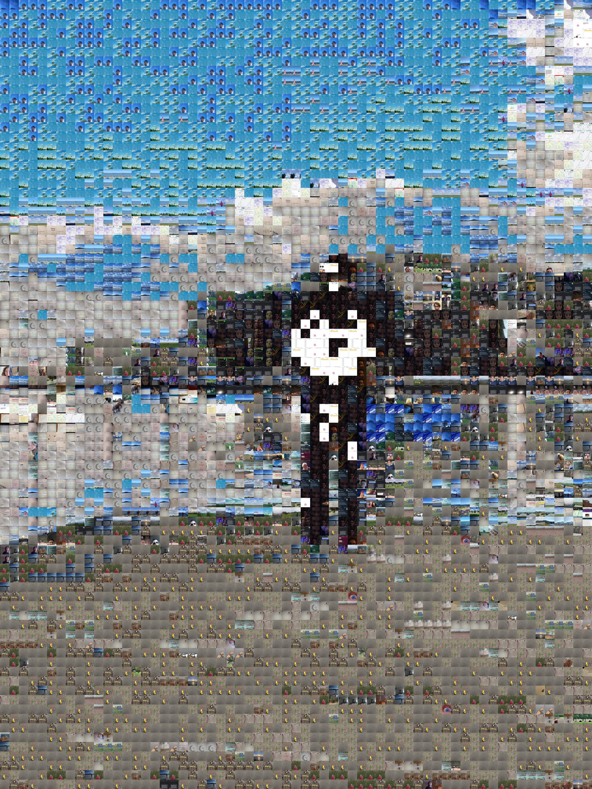

# Graphic
This project began a while ago as messing around with ascii-based graphics using python, and it evolved somewhat into a general purpose repository for image processing things that I'm working on.

## AsciiGraphic
A project for converting images and videos into ascii-based images and videos, which can be played/displayed in a console

## Tiling
Code for tiling images to compose into other images
The following is an example of an image composed of a set of other images, where L1 distance is used to compare the image blocks and find the closest one:
